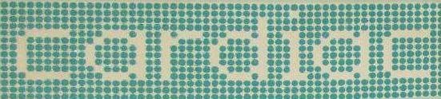
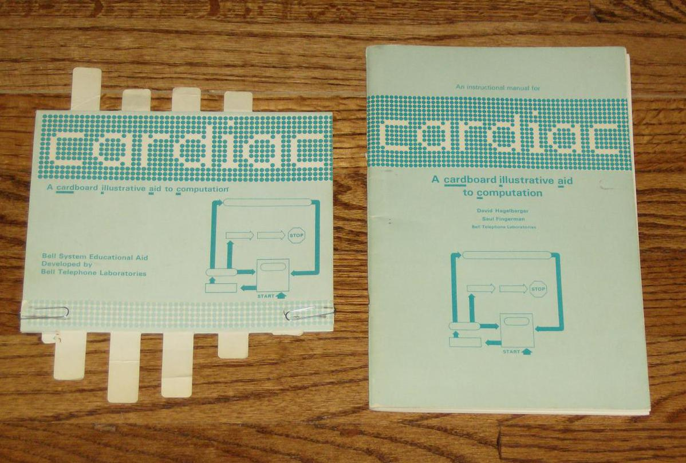
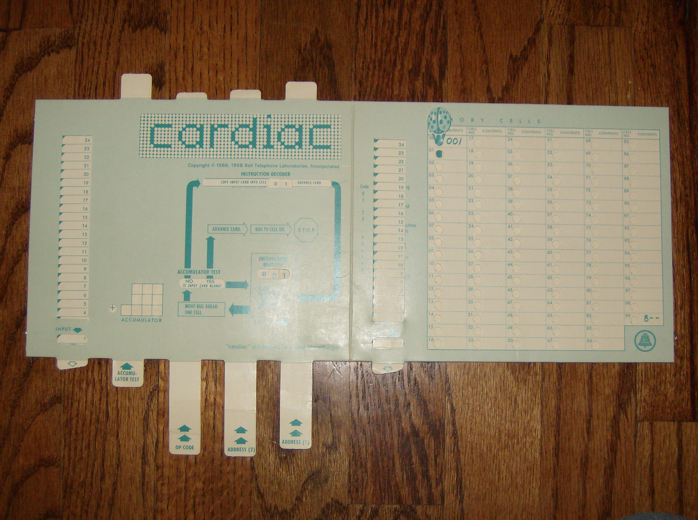
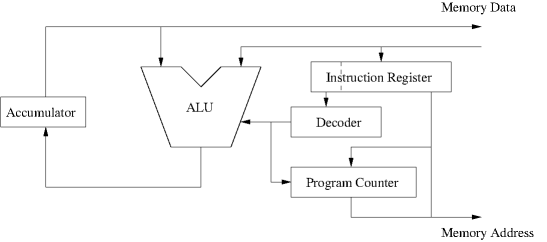
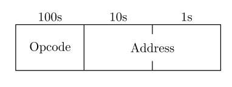
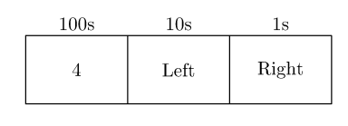

# 

## Source

This was copied from [CARDiac Museum](https://www.cs.drexel.edu/~bls96/museum/cardiac.html).  Conversion to Markdown, minor corrections and updated done by [Matthew Whited](https://github.com/mwwhited)

* [Simulator Notes](./notes-simulator.md)
* [Example Applications](./notes-examples.md)

## Background

* these notes are copied from 

The acronym CARDIAC stands for *CARDboard Illustrative Aid to Computation.* It was developed by David Hagelbarger at Bell Labs as a tool for teaching how computers work in a time when access to real computers was extremely limited. The CARDIAC kit consists of a folded cardboard *computer* and an instruction [manual](./CARDIAC_manual.pdf). In July 1969, the Bell Laboratories Record contained an [article](./cardiac.pdf) describing the system and the materials being made available to teachers for working with it.

As illustrated in the following pictures, the CARDIAC computer consisted of a left-hand CPU section and a right-hand memory section. On the CPU side there are five sliders:

* One slider of input "cards"
* One slider for the accumulator sign
* Three sliders for the digits of an instruction

The memory side has a single slider of output "cards." Portions of the sliders show through cutouts in the card frame. The cutouts for the input and output card sliders each show the current card to be read or written. The combination of the accumulator sign and the three instruction sliders show steps through cutouts that describe the operation of the selected instruction. Effectively, the sliders and cutouts are the instruction decoder of the CPU. Finally, each memory location has a hole in it. A small carboard ladybug serves as the program counter which is moved from location to location in response to the steps described on the CPU side.

The CARDIAC manual is 50+ pages divided into 16 sections describing the basics of computers from a late 1960s perspective. The first six sections cover things like flow charts, instructions, data, addresses, and the stored program concept. Sections 7–12 discuss the CARDIAC and some basic programming techniques including loops and multiplication. Sections 13 and 14 discuss the techniques for bootstrapping and subroutines, both of which we elaborate on [below](#subroutines). Section 15 focuses on the development of a program to play NIM. Finally, Section 16 discusses assemblers and compilers. Although there is some duplication of information, the material on this page is not intended to replace the manual. Rather, the material here expands on that in the manual, particularly from the point of view of one who is already familiar with the most basic concepts of computers and programming.

## Pictures

### Book and "Computer"



### Open CARDIAC



## CARDIAC architecture

### Memory

The CARDIAC has a grand total of 100 memory locations identified by the two-digit decimal numbers 00 through 99. Each memory location holds a signed three-digit decimal number. *With the exception of a single code example, the CARDIAC book is actually silent on whether memory contains signed or unsigned values.* Locations 00 and 99 are special. Location 00 always contains the value 001, which as we see [below](#instruction-set) is the instruction to read a card into location 01. This special value is used the the bootstrapping process discussed later. Location 99 always contains a value between 800 and 899. The tens and ones digits of the number are the value of the program counter after a jump instruction is executed. This provides the mechanism for a return from subroutine.

### CPU

The CARDIAC CPU is a single-accumulator single-address machine. Thus each instruction operates optionally on a single memory location and the accumulator. For example, the ADD instruction reads the data in one memory location, adds it to the current value of the accumulator and stores the result back into the accumulator. The ALU supports addition, subtraction, and decimal shifting. CARDIAC's CPU architecture is illustrated in the following figure:



The CARDIAC accumulator holds a signed 4-digit number, which seems odd given that everything else is oriented around 3-digit numbers. The manual includes the statement:

> Since CARDIAC's memory can store only 3-digit numbers, you may be puzzled by the inclusion of an extra square in the accumulator. It is there to handle the overflow that will result when two 3-digit numbers whose sum exceeds 999 are added.

What's not clear is under what conditions that overflow/carry digit is kept or discarded. From the discussion of the SFT instruction in Section 12 of the manual, exactly four digits are kept for the intermediate value between the left and right shift operations. However, the manual doesn't state whether all four digits are kept between instructions nor what happens when storing the accumulator to memory if the accumulator contains a number whose magnitude is greater than 999. In the case of our simulator, we retain all four digits, effectively implementing a 4-digit ALU. However, when storing the accumulator to memory, we discard the fourth digit. I.e. the number stored in memory is a mod 1000, where a is the contents of the accumulator.

### I/O

The CARDIAC has exactly one input device and one output device. These are a card reader and a card punch. Unlike real punch cards, the CARDIAC input and output cards can each hold exactly one signed three-digit number. When a card is read by way of the INP instruction, it is taken into the card reader and removed from the stack of cards to be read. Similarly, on each OUT instruction, a new card is "punched" with the specified value on it, and the card moved to the output card stack.

## Instruction Set

The CARDIAC's instruction set has only 10 instructions, each identified by an operation code (opcode) of 0 through 9. The instructions are as follows:

| Opcode | Mnemonic	| Operation                                      | 
| ------ | -------- | ---------------------------------------------- |
| 0      | INP      | Read a card into memory                        |
| 1      | CLA      | Clear accumulator and add from memory (load)   |
| 2      | ADD      | Add from memory to accumulator                 |
| 3      | TAC      | Test accumulator and jump if negative          |
| 4      | SFT      | Shift accumulator                              |
| 5      | OUT      | Write memory location to output card           |
| 6      | STO      | Store accumulator to memory                    |
| 7      | SUB      | Subtract memory from accumulator               |
| 8      | JMP      | Jump and save PC                               |
| 9      | HRS      | Halt and reset                                 |

### Encoding

All instructions are non-negative numbers expressed as three-digit decimal numerals. The CARDIAC manual doesn't describe what happens if an attempt is made to execute a negative instruction. In our simulator, we treat negative instructions as no-ops (i.e. they are ignored and the program continues on to the next instruction). The operation code is the most significant of those three digits, i.e., o=⌊i /100⌋, where i is the contents of the instruction register (IR) loaded from the memory location specified by the PC. For most instructions, the lower-order digits are the address of the operand, i.e. a=i mod 100. This arrangement is illustrated in the following figure.



In the cases of the INP and STO instructions, a is the destination address for the data coming from either an input card or the accumulator, respectively. In the cases of the CLA, ADD, OUT, and SUB instructions, a is the source address of the second operand to the ALU or the source address of the operand being written to an output card. For the TAC, JMP, and HRS instructions, a is the address to be loaded into the PC (conditionally, in the case of the TAC instruction). The remaining instruction, SFT, doesn't treat the lower-order digits as an address. Instead, each of the lower-order digits is a number of digit positions to shift first left, then right. The left shift count is given by l=⌊a /10⌋, and the right shift count is given by r=a mod 10. The instruction format for the SFT instruction is shown in the following figure:



### Instruction Execution

The instructions operate as described here. In this discussion, we use the following notation:

| Notation | Meaning                                                 |
| -------- | ------------------------------------------------------- |
| ACC      | Contents of the accumulator                             |
| PC       | Contents of the program counter                         |
| a        | Operand address as described in the previous subsection |
| MEM[x]   | Contents of memory location x                           |
| INPUT    | Contents of one card read from the input                | 
| OUTPUT   | Contents of one card written to the output              |

#### INP     

The INP instruction reads a single card from the input and stores the contents of that card into the memory location identified by the operand address. 

```
MEM[a] ← INPUT
```

#### CLA

This instruction causes the contents of the memory location specified by the operand address to be loaded into the accumulator. 

```
ACC ← MEM[a]
```

#### ADD

The ADD instruction takes the contents of the accumulator, adds it to the contents of the memory location identified by the operand address and stores the sum into the accumulator. 

```
ACC ← ACC + MEM[a]
```

#### TAC

The TAC instruction is the CARDIAC's only conditional branch instruction. It tests the accumulator, and if the accumulator is negative, then the PC is loaded with the operand address. Otherwise, the PC is not modified and the program continues with the instruction following the TAC. 

```
If ACC < 0, PC ← a
```

#### SFT

This instruction causes the accumulator to be shifted to the left by some number of digits and then back to the right some number of digits. The amounts by which it is shifted are shown above in the encoding for the SFT instruction. 

```
ACC ← (ACC × 10^l) / 10^r
```

#### OUT

The OUT instruction takes the contents of the memory location specified by the operand address and writes them out to an output card. 

```
OUTPUT ← MEM[a]
```

#### STO

This is the inverse of the CLA instruction. The accumulator is copied to the memory location given by the operand address. 

```
MEM[a] ← ACC
```

#### SUB

In the SUB instruction the contents of the memory location identified by the operand address is subtracted from the contents of the accumulator and the difference is stored in the accumulator. 

```
ACC ← ACC − MEM[a]
```

#### JMP

The JMP instruction first copies the PC into the operand part of the instruction at address 99. So if the CARDIAC is executing a JMP instruction stored in memory location 42, then the value 843 will be stored in location 99. Then the operand address is copied into the PC, causing the next instruction to be executed to be the one at the operand address. 

```
MEM[99] ← 800 + PC; PC ← a
```

#### HRS

The HRS instruction halts the CARDIAC and puts the operand address into the PC. 

```
PC ← a; HALT
```

### Assembly Language

All of the code fragments and complete program examples on this page are shown in an assembly language format with each line organized into six columns:

1. *Address* The first column shows the memory address respresented by that line.

2. *Contents* In the second column, we put the number that is stored in that memory location.
In most cases, this is a instruction, but for lines with a DATA pseudo-op, it is a data value.

3. *Label* The third column contains an optional label on the memory location, allowing it to be identified by name, rather than by address.

4. *Opcode* Instruction mnemonics are places in the fourth column. In addition to the ten instructions discussed above, we will use on pseudo-op (or assembler directive), DATA. For memory locations containing a DATA item, the operand is the literal data value stored in the memory location, rather than an operand for an instruction. This pseudo-op is particularly useful when labeled for creating variables.

5. *Operand* The fifth column is the operand part of the instruction or the literal data for a DATA directive. Numerical operands are included directly in the address field of the instruction. When a label name appears as an operand, the memory address associated with that label is placed in the address field of the instruction.
6. *Comment* Any desired descriptive text can be placed after the operand.

## Indirection, Indexing, and Pointers

Notice that the only way of specifying the address of a memory location we want to use is in the instruction itself. Most computer architectures provide a mechanism whereby the address we want to use can be stored in a register or another memory location. Variables which contains memory addresses are usually referred to as pointers.

### Indirect Loads

Even though the CARDIAC doesn't have hardware support for using pointers directly, we can still do simple indirect addressing. Suppose we have a variable stored in a memory location called ptr and it has the value 42 in it. Now if we want to load the accumulator with the contents of memory location 42, we can do something like:

```assembly
05    100  loader    DATA  100
06    042  ptr       DATA  042
 
20    105            CLA   loader
21    206            ADD   ptr
22    623            STO   indload
23    100  indload   CLA   00
```

Notice that even though we have specified that we will load from location 00 in the instruction at location 23, we will have changed it to load from location 42 by the time we run execute that instruction. For that matter, it doesn't matter if we've loaded anything into location 23 before starting this sequence. It will get set before we use it.

### Indirect Stores

Storing the accumulator to a memory location identified by a pointer is similar. We just have to be careful not to lose the value we want to store while we're fiddling about with the store instruction and in the following bit of code:

```assembly
05  600  storer   DATA  600
06  042  ptr      DATA  042
07  000  acc      DATA  000
  
20  607           STO   acc
21  105           CLA   storer
22  206           ADD   ptr
23  625           STO   indstor
24  107           CLA   acc
25  600  indstor  STO   00
```

### Array Indexing

Often we aren't so much interested in a pointer that identifies a single memory location as we are in an array of memory locations we can refer to by index. We will identify our array locations starting at index 0. So the first element of the array is at index 0, the second at index 1, and so on. If we have a variable called base that holds the first address of the array, then we can just add the base and the index together to get the address of a particular element. This is just a slight modification of the indirect accesses [above](#indirect-stores). In particular, to load from an array element:

```assembly
05  100  loader   DATA  100
06  042  base     DATA  042
07  000  index    DATA  000

20  105           CLA   loader
21  206           ADD   base
22  207           ADD   index
23  624           STO   arrload
24  100  arrload  CLA   00
```

and for storing to an array element:

```assembly
05  600  storer   DATA  600
06  042  base     DATA  042
07  000  index    DATA  000
08  000  acc      DATA  000
 
20  608           STO   acc
21  105           CLA   storer
22  206           ADD   base
23  207           ADD   index
24  626           STO   arrstor
25  108           CLA   acc
26  600  arrstor  STO   00
```

If we're dealing with only one array, we could eliminate one add instruction from each sequence by pre-adding the base and loader and pre-adding the base and storer.

### Stacks

Another use of indirect address is the stack data structure. If you're not familiar with a stack, think of it like a stack of plates in a cafeteria. A plate is always placed on top of the stack. Likewise, the one removed is always the one on the top of the stack. We refer to the process of putting an element onto a stack as pushing and the process of taking an element off of a stack as popping. Note that we always pop that most recently pushed element. Because of this, the stack is often referred to as a last-in, first-out (LIFO) data structure. Pushing and popping are very similar to storing and loading indirectly, except that we must also adjust the value of the pointer that identifies the top of the stack. In the following code we'll use a memory location named tos (for top-of-stack) for the pointer. Also, we'll do as is often done in hardware stacks and let the stack grow downward. That is to say, as we push data onto the stack, the stack pointer moves toward lower memory addresses. With that in mind, here is a fragment of code for pushing the accumulator onto the stack:

```assembly
05  600  storer  DATA  600
06  100  loader  DATA  100
07  089  tos     DATA  089
08  000  acc     DATA  000

20  608          STO   acc
21  107          CLA   tos
22  205          ADD   storer
23  628          STO   stapsh
24  107          CLA   tos
25  700          SUB   00
26  607          STO   tos
27  108          CLA   acc
28  600  stapsh  STO   00
```

And similarly to pop from the top of the stack:

```assembly
20  107          CLA  tos
21  200          ADD  00
22  607          STO  tos
23  206          ADD  loader
24  625          STO  stapop
25  100  stapop  CLA  00
```

These code fragments *slightly modified* are used in the [example](./notes-examples.md#list-reversal) that uses the LIFO properties of the stack to reverse the order of a list of numbers on the input cards.

### Subroutines

There are many reasons why we might wish to subdivide a program into a number of smaller parts. In the context of higher level languages and methodologies, these subdivisions are often referred to by names like procedures, functions, and methods. All of these are types of subroutines, the name we usually use when working at the hardware or machine language level. In these sections, we look at the techniques for creating and using subroutines on the CARDIAC. Each subsection progressively builds from the simplest subroutine technique to more complex and advanced techniques. Don't worry if not all of it makes sense on a first reading. You can get a good sense of the general idea of subroutines without necessarily understanding the details of how recursion is implemented on a machine as limited as the CARDIAC.

#### Single Simple Subroutines

In the CARDIAC, the JMP instruction is effectively a jump-to-subroutine instruction, storing the return address in location 99. Because the address stored in location 99 is prefixed by the opcode 8, the instruction in that location becomes a return-from-subroutine instruction. Thus any segment of code whose last instruction is at location 99 can be called as a subroutine, simply by jumping to its first instruction. For example, a simple routine to double the value of the accumulator could be coded as:

```assembly
96  000  accval DATA  000

97  696  double STO   accval
98  296         ADD   accval
99  800         JMP   00
```
and the subroutine can be called with a jump to double:

```assembly
    897         JMP   double
```

#### Multiple Subroutines

Clearly, if our subroutine executes a JMP instruction or if it calls another subroutine, then we will lose our return address, because it will be overwritten by the JMP instruction. Along similar lines, if we have more than one subroutine in our program, only one of them can be at the end of the memory space and flow directly into location 99.

As a result, in many cases, we'll need a more involved subroutine linkage mechanism. One way to accomplish this is to save the return address somewhere and restore it when needed. If we use this method, we'll have to devise a mechansism to transfer control to location 99 with the right return address. Although location 99 can itself be used as the return from subroutine instruction, it doesn't have to be. In many cases, it will be easier to copy it to the end of our actual subroutine. Using this approach, we can write a subroutine that outputs the value of the accumulator as follows:

```assembly
80  686  aprint  STO  86
81  199          CLA  99
82  685          STO  aexit
83  586          OUT  86
84  186          CLA  86
85  800  aexit   JMP  00
```

Similarly, our doubling routine would look like:

```assembly
90  696  double  STO  96
91  199          CLA  99
92  695          STO  dexit
93  196          CLA  96
94  296          ADD  96
95  800  dexit   JMP  00
```

See [below](./notes-examples.md#powers-of-2) for an example of a program that uses these subroutines to produce a list of powers of two.

#### Recursion

There's one more limitation on subroutines still in the techniques we have developed. What happens if a subroutine calls itself? You might reasonably as, is it even useful for a function call itself? The answer is, yes, and it called recursion.

The key to making it possible for a subroutine to call itself is to realize that no matter where we're called from, we always want to return to the place from which we were most recently called that we haven't already returned to. That should sound familiar. We should use the return addresses in the same LIFO order that a stack provides. In other words, when we call a recursive subroutine, we want to push the return address onto a stack and then pop it back off when we return from that subroutine. With a little reflection, we can see that this approach applies to all subroutine calls, not just to those that are recursive. This is why pushing return addresses on a stack is the basis for hardware subroutine call support in most architectures since about the 1970s on.

On the CARDIAC, we can implement this technique with a modification of the multiple subroutine technique [above](#multiple-subroutines). When entering a subroutine, rather than copying location 99 to the return from subroutine instruction, we push the contents of location 99 onto the stack. Then when we're about to return from the subroutine, we pop the return address off the stack into the return from subroutine instruction. So our code would look something like:

```assembly
    1xx          CLA  tos
    2yy          ADD  storer
    6zz          STO  stapsh
    1xx          CLA  tos
    700          SUB  00
    6xx          STO  tos
    199          CLA  99
zz  600  stapsh  STO  00
     .
     .  	body of the subroutine
     .
    1xx          CLA  tos
    200          ADD  00
    6xx          STO  tos
    2ww          ADD  loader
    6ss          STO  stapop
ss  100  stapop	 CLA  00
    6rr          STO  rts
rr  800  rts     JMP  00
```

There's one more aspect of recursive subroutines that is also suitable for other subroutines as well. In particular, subroutines often need input data passed to them by whatever code has called them or temporary variables that are needed during the course of their operation. If a subroutine is not recursive, we can get away with just allocating some fixed memory locations for these. However, in the case of recursive subroutines, we need to make sure that we have fresh ones for each time the subroutine is called and not overwrite the ones that might still be needed by other instances we might return back to. The most natural way to handle this is to allocate them on the stack along with the return address.

Putting all these things together, we can summarize the steps for calling a subroutine in the most general cases:

1. Before calling the subroutine, we push any inputs (also called arguments or parameters) onto the stack.

2. Transfer control to the first instruction of the subroutine, saving the PC (which holds the return address) in the process.

3. If the hardware has not already saved the PC onto the stack, the first thing we do in the subroutine is copy it to the stack.

4. Move the stack pointer to resever space on the stack for any temporary (local) variables the subroutine will need.

5. Before returning, the subroutine readjusts the stack pointer to remove the temporary variables it allocated.

6. If the hardware does not already expect the return address to be on the stack, we need to pop it off the stack and copy it back to where it does need to be.

7. Return control from the subroutine back to the code that called it.

8. Finally, the calling code adjusts the stack pointer to remove the arguments it pushed onto the stack before calling the subroutine.

## Bootstrapping

Like many of the early system designs, the mechanism for loading an initial program into the CARDIAC and getting it running involves a small amount of hardware support and a lot of cleverness. The whole enterprise is often somewhat remenescent of the image of a person attempting to lift themselves off the ground by pulling on their own bootstraps. This is why we usually refer to the process as bootstrapping or often just booting.

The CARDIAC's hardware support for bootstrapping is the fixed value of memory location 00. The fixed contents of this memory location are 001 which is the instruction to load a single card into location 01. Naturally, after executing this instruction, the PC moves to location 01 and executes the instruction on the card just read. But what do we put on that card to load? The answer is 002, which is the instruction to load a card into location 02. This causes us to load a second card into location 02 and execute it. At first glance, it would seem we haven't really improved things any, because we're right back where we're still just loading a single card and executing it. But here's where the first bit of cleverness comes in. The card we load into location 02 has the value 800 on it which causes us to jump back to location 00 which will load another card into location 01. We now have a loop that loads cards into location 01 and executes them. If the instructions we put into location 01 are reads of cards into other memory locations, we now have a little program that reads a whole set of cards into memory. Conveniently, a card containing just a memory address also contains the instruction to read a card into that memory address. So if the next card we read after the 800 is, say, 010, then location 01 will be changed to an instruction to read a card into location 10, after which we'll execute the 800 instruction to jump back to location 00 and do it all over again. This means that after the 002 and 800 cards, we can have pairs of cards where the first of the pair is the address where we want to put some data, and the second of the pair is the data to put there.

If this is all we did, we'd read all the remaining cards into memory and then the computer would halt when there were no more cards to read. But there's another trick we can play. If we make the last address-data card pair change location 02 from 800 to a jump to the first instruction of our program, the loader loop will stop and control will transfer to the program we just loaded. So after all of our address-data card pairs, we'll append the cards 002 and 8xx where xx is the address of the first instruction of our program. The net effect is that we can now load a program and start running it without any manual intervention.

The last piece of this puzzle is how do we include the data we want the program to operate on? It turns out, that's a simple as just appending the data after the 002 and 8xx cards. When control transfers to the program we loaded, any remaining cards will still be in the reader waiting to be read. When the program executes its first INP instruction, it will happily read the next card, not knowing that there were a bunch of other cards read ahead of it.

So putting all the pieces together, we bootstrap the CARDIAC by putting together a card deck that looks like:

```assembly
    002  
    800  
     .
     .   address-data card pairs
     .
    002  
    8xx  where xx is address of the first instruction
     .
     .   data cards
     .
 ```

Then we put that deck into the card reader, and start the computer at address 00. The CARDIAC will first load the two-card bootstrap loader, then load the program into memory, then transfer control to the newly loaded program. If the program itself also includes INP instructions, they read the remaining data cards.

## Other CARDIAC Resources

* [The obligatory Wikipedia reference](http://en.wikipedia.org/wiki/CARDboard_Illustrative_Aid_to_Computation)
* [A blog entry on the CARDIAC](http://techblog.ironfroggy.com/2014/10/cardiac-cardboard-computer.html)
* [A CARDIAC simulator written in Python](http://www.pythondiary.com/blog/Oct.15,2014/building-cpu-simulator-python.html)
* [An assembler for CARDIAC written in Python](http://www.pythondiary.com/blog/Oct.19,2014/building-cardiac-assembler-python.html)
* [A CARDIAC simulator in the form of a spreadsheet](http://www.drdobbs.com/embedded-systems/cpu-design-on-paper/240153480)
* [Discussion of an FPGA implementation of CARDIAC](http://www.drdobbs.com/embedded-systems/paper-to-fpga/240155922)

## Related Work

* [A single instruction set computer design and simulator by Peter Crampton](https://www.cs.drexel.edu/~bls96/oisc/)

## Original Material 

This was copied from [CARDiac Museum](https://www.cs.drexel.edu/~bls96/museum/cardiac.html).  

* [Brian L. Stuart](http://cs.drexel.edu/~bls96/) 
* [Department of Computer Science](http://cs.drexel.edu/)
* [Drexel University](http://www.drexel.edu/)

## Updates and Corrections

Conversion to Markdown, minor corrections and updated done by [Matthew Whited](https://github.com/mwwhited)
