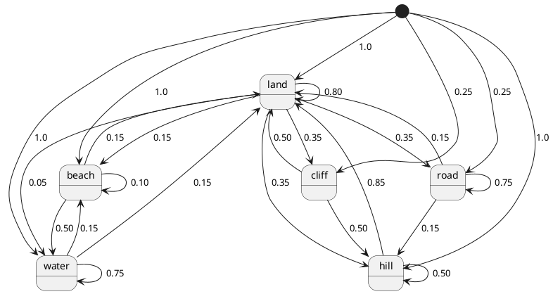

# Notes

## Markov graph

Example graph for controling procedual generation

```plantuml
@startuml

[*]		-->		land	: 1.0
[*]		-->		beach	: 1.0 
[*]		-->		water	: 1.0 
[*]		-->		road	: 0.25
[*]		-->		cliff	: 0.25 
[*]		-->		hill	: 1.0 

land	-->		beach	: 0.15
land	-->		water	: 0.05
land	-->		land	: 0.80
land	-->		road	: 0.35
land	-->		cliff	: 0.35
land	-->		hill	: 0.35

beach	-->		beach	: 0.10
beach	-->		land	: 0.15
beach	-->		water	: 0.50

water	-->		beach	: 0.15
water	-->		land	: 0.15
water	-->		water	: 0.75

road	-->		hill	: 0.15
road	-->		land	: 0.15
road	-->		road	: 0.75

cliff	-->		hill	: 0.50
cliff	-->		land	: 0.50

hill	-->		hill	: 0.50
hill	-->		land	: 0.85

@enduml
```